# FatigueMeter: A Multi-Timescale Model for Cyclist Fatigue from Power, Heart Rate, and HRV

**A design white paper — Revision 3**
Status: draft for implementation · Companion to [literature-review.md](literature-review.md)

> **Revision 3 (2026-07-12)** — second review round incorporated. Principal changes: (a) corrected the filter to a **linear (time-varying) Kalman filter** (the model is linear in the state; the earlier "EKF" call was wrong); (b) **wired the fB/artifact de-weighting into the filter** so the α1→F coupling cannot manufacture fatigue from breathing/artifact, and stated the shared-driver/correlated-noise overconfidence; (c) made **heat handling coherent** — `F` owns thermal drift and the advisory names heat as a co-driver rather than discounting it; (d) **specified the AFI/decoupling blend** and kept the 0–100 scale reference-consistent; (e) moved the severe-band and decoupling triggers to **per-athlete drift** (the fixed `AFI>85`/8% are `F_ref`-dependent conventions); (f) gated `κ_d` on **active** riding; (g) **bucketed** start-of-ride and "fatigue added"; (h) **recorded a decision to gate the precise numeric AFI + projected tick on a criterion-validity study**, with a **coarse 3-state (green/amber/red) categorical** pre-pilot; (i) fixed the pilot statistics (association, not Bland–Altman; n≈5 = proof-of-concept); (j) added a **sensor-availability / graceful-degradation** section (§8.4) so any missing sensor never blocks the rest; (k) terminology/observability-label/soft-bound cleanups. A point-by-point disposition accompanies this revision.
>
> **Revision 2 (2026-07-12)** — revised in response to external scientific-validity review. Principal changes: (a) **honest reframing** — this is a per-athlete-**calibrated durability/decoupling dashboard with an advisory**, not a validated fatigue *meter*; (b) the Layer-2 filter now **genuinely couples DFA-α1 into the fatigue state** and carries an explicit **observability caveat**; (c) the fatigue state is **renamed and de-attributed** from "the VO₂ slow component" to residual cardiovascular drift; (d) the **hard critical-power gate on drift is removed** (sub-CP cardiovascular drift is real); (e) productive-window signals are no longer described as "independent," verdicts are **descriptive not imperative**, and the banner carries a persistent "heuristic — not validated" treatment; (f) the absolute DFA-α1 fatigue band is **demoted to display-only**; (g) provenance now separates **extraction confidence from evidence strength** and records sample sizes/replication; (h) "validate against labeled rides" is corrected to **"calibrate to self-consistency,"** with a separate criterion-validity pilot added. A point-by-point disposition of the review feedback accompanies this revision.

---

## Abstract

FatigueMeter specifies a system that **estimates and displays** cyclist durability and fatigue markers on two timescales — **acute (within-ride)** and **residual (training-program)** — from three consumer signals: mechanical power, heart rate, and beat-to-beat RR intervals. It requires no gas-exchange hardware. The design rests on the observation that autonomic drift and cardiovascular decoupling **co-vary with** (but are not a direct measurement of) the aerobic VO₂ slow component and organismic-complexity loss, and can be *inferred as latent states* from how heart rate and HRV decouple from power over time. The system produces four families of output: (1) a within-ride **acute fatigue index (AFI)** — an *index*, not a measured quantity — with a concerning-value scale; (2) live **on-ride metrics** on a single glance screen; (3) a **durability advisory** flagging when markers indicate continued riding is mostly fatigue rather than stimulus; and (4) **start-of-ride and end-of-ride** fatigue estimates connecting the residual and acute models. **Positioning (important):** the individually *validated* pieces here are the observable primitives — aerobic decoupling, CTL/ATL/TSB load accounting, durability-drift magnitudes, and the population-level DFA-α1 = 0.75 threshold anchor. The **fused AFI and the productive-window advisory are new, synthesis-grade constructs** that have **not** been validated against any external fatigue criterion; there is no fatigue ground truth available on-device. They must be **calibrated to per-athlete self-consistency** and treated as advisory estimates with visible uncertainty — never as measurements. Every numeric threshold carries a provenance flag separating how confidently it was extracted from a source from how strong that source's evidence is.

---

## 1. Problem statement and design constraints

A cyclist wants to know, in the field and afterward: *How fatigued am I right now? Is this ride still doing me good, or am I just digging a hole? How much of today's fatigue did I bring with me, and how much did I add?*

**Constraints that shape every decision:**

- **Sensors:** power (1 Hz), HR (1 Hz), RR intervals (beat-to-beat). DFA-α1 **requires an RR-capable chest strap (Polar H10 class)**; wrist optical HR is not adequate (§4, literature review). No VO₂, no lactate, no NIRS assumed (but SmO₂ is an optional future input).
- **Platform:** Garmin Connect IQ (Monkey C). A small linear/extended Kalman filter is trivial to run at 1 Hz; the real compute budget is the **DFA-α1 sliding window** (recompute every 5 s, not every beat). This mirrors the known Connect IQ constraint from sibling projects that high-rate streaming work must be carefully budgeted.
- **Honesty:** the fused fatigue states are not directly validated by any single paper. Outputs must be presented as estimates with visible uncertainty, and the app must ship with a calibration path.

---

## 2. Model architecture: three coupled layers

```
                 ┌─────────────────────────────────────────────┐
   Ride history  │  LAYER 3 — Residual fatigue (days–weeks)     │
   (TSS/TRIMP)   │  CTL / ATL / TSB  +  ACWR  +  resting-HRV    │──► Start-of-ride fatigue state
                 └───────────────────────┬─────────────────────┘
                                         │ seeds
                 ┌───────────────────────▼─────────────────────┐
 power, HR, RR   │  LAYER 2 — Acute fatigue estimator (seconds) │
     (1 Hz)      │  4-state Kalman filter (α1 coupled into F):   │──► On-ride Acute Fatigue Index (AFI)
                 │  HR_ss, HR, DFA-α1, F (cardiovascular drift)  │──► End-of-ride fatigue state
                 └───────────────────────┬─────────────────────┘
                                         │ feeds
                 ┌───────────────────────▼─────────────────────┐
 power, HR, RR   │  LAYER 1 — Observable primitives             │
   + cadence     │  decoupling%, kJ (intensity-weighted),       │──► Durability advisory (descriptive)
                 │  DFA-α1, cadence drift, W′bal                 │
                 └─────────────────────────────────────────────┘
```

Layer 1 computes cheap, directly-measured quantities — these are the **validated backbone**. Layer 2 fuses them into a latent acute-fatigue *index* (synthesis-grade, calibrated per athlete). Layer 3 accounts for the slow, residual fatigue that the athlete brings to the ride and carries away from it. The layers are coupled: Layer 3 **seeds** Layer 2's initial fatigue state (answering "start-of-ride fatigue"), and Layer 2's final state plus the ride's load **updates** Layer 3 (answering "end-of-ride fatigue" and next-day residual).

---

## 3. Layer 1 — Observable primitives (directly measured)

These require no model and are the trustworthy backbone.

### 3.1 Aerobic decoupling (rolling, real-time)
Convert the retrospective half-split into a live signal: establish a baseline **Efficiency Factor** over a stable early window (minutes 5–15), then report the running rise.
```
EF_window   = NormalizedPower_window / meanHR_window      (rolling, e.g. trailing 5–10 min)
EF_baseline = EF over minutes 5–15 at the ride's working intensity
Decoupling% = (EF_baseline − EF_window) / EF_baseline × 100
```
NormalizedPower = 4th-root of the 30 s rolling average of power⁴. **Thresholds (Friel/TrainingPeaks convention, configurable defaults, not validated damage cutoffs):** <5% healthy · 5–8% caution · >8–10% above-threshold/depleted. Suppress or annotate in high heat.

> **Validity caveats (added in Rev 2).** (1) NP and the decoupling/EF construct were defined and validated over **whole intervals/rides (≥~20 min)**; computing them over trailing 5–10 min windows with coasting is an **engineering adaptation that is unvalidated at that granularity** and is noisy on variable terrain. (2) The published decoupling thresholds come from **controlled steady efforts**, not free outdoor riding. Require a **steadiness gate** — emit decoupling only when the window's power coefficient-of-variation and coasting fraction are below configurable limits — and mark the value low-confidence otherwise. (3) At sub-threshold intensity (~75% FTP) real-world decoupling is a **low-SNR channel**: mean ≈ 2% with SD ≈ mean (Barsumyan 2026), i.e. some riders couple negatively. Do not over-read small decoupling values.

### 3.2 Intensity-weighted work (kJ clock)
```
kJ            = Σ power(W) · Δt / 1000
kJ_weighted   = Σ w(power) · power · Δt / 1000,   w(power) = 1 below CP, ramping to ~2–3× well above CP
```
Durability decline is driven by *intensity*, not raw volume (Spragg 2024). Person-specific warning anchors: ~1,500 kJ (developing/U23-like) to ~2,500 kJ (well-trained), defaulted by CTL and refined by calibration.

### 3.3 DFA-α1 (rolling)
2-min RR window, recomputed every 5 s, box sizes 4–16 beats, per-box linear detrend, **hard artifact gate at 5%** (prefer <3%). Emit both the value and a quality flag. See §4 of the literature review for the exact pipeline.

> **Stationarity gate (added in Rev 2 — first-order concern).** DFA-α1's short-term scaling estimate presumes **local stationarity** of the RR series, and *all* of its validation was collected under controlled constant-workload or incremental-ramp conditions in the lab. Outdoors, a moving 2-min window will routinely **straddle large power/cadence transients** (surges, coasting, stops, cornering, drafting), violating those conditions — and **field RR-artifact rates on a moving bike are uncharacterized** in the cited literature. Therefore, gate α1 not only on artifact % but on **within-window power/HR stationarity** (suppress or down-weight when within-window power CV or coasting fraction exceeds a configurable threshold). Treat within-ride α1 as **provisional until validated on the athlete's own outdoor rides**. Additionally, α1 in the 4–16-beat band is strongly shaped by **respiratory sinus arrhythmia**; where possible derive respiratory frequency (fB) from the same RR stream and use it to flag ventilation-driven α1 movement rather than attributing it to fatigue.

### 3.4 Cadence drift & W′bal
Second-half (or rolling) cadence decline as a corroborating fatigue vote (~0.6% expected decoupling per rpm, Barsumyan). W′bal depletion pattern from CP/W′ as an additional severe-domain fatigue input (Skiba differential form).

---

## 4. Layer 2 — Acute fatigue estimator (a calibrated index, not a measurement)

A compact Kalman filter combines power (a clean exogenous input) with HR and DFA-α1 (noisy, drifting observations) to estimate a latent **residual cardiovascular-drift** state `F`. Its architecture is **inspired by** PM-EKF and the level+velocity HR sub-model of "From Lab to Wrist" (both **arXiv preprints**, borrowed as starting-point structure requiring independent tuning — one of them reports HR contributed no significant accuracy in its own setup, and its noise matrices were unreadable), and its intensity-graded drift term is **inspired by** DALE's gating structure. **What DALE does *not* provide here:** DALE describes a **VO₂** phenomenon fitted to n=8; `F` is an **HR-drift** phenomenon in bpm. No source establishes that HR drift and the VO₂ slow component share a time course or a critical-power gate at the individual level, so DALE lends a *functional form*, not physiological validation, and its "Validated" status attaches only to the VO₂ constants (§9).

> **Rev 2 — two structural fixes from review.** (1) In Rev 1 the fatigue state entered only the HR equation, so **DFA-α1 measurements contributed zero information to `F`** — it was not a fusion. `F` is now coupled into the α1 transition (§4.2), so α1 innovations genuinely update the fatigue estimate. (2) The **hard critical-power gate** on `F` was removed: cardiovascular drift occurs during prolonged **sub-CP** riding (thermoregulation, plasma-volume loss) — indeed the supporting Barsumyan data were collected at 75% FTP, below CP — so a CP gate would wrongly forbid real drift. The charge term is now graded by **both intensity and duration**.

### 4.1 State vector
```
x = [ HR_ss , HR , A1 , F ]ᵀ
```
- `HR_ss` — quasi-steady HR the current power would elicit when fresh (bpm)
- `HR` — latent actual HR (bpm); lags HR_ss and is lifted by drift
- `A1` — latent DFA-α1 (dimensionless)
- `F` — **residual cardiovascular-drift state** = the upward HR drift at fixed power that the static power→HR term cannot explain (bpm; 0 when fresh). **Honest labeling (Rev 2):** `F` is *not* the VO₂ slow component. It is a catch-all residual that absorbs **everything** lifting HR at fixed power — thermoregulatory/plasma-volume drift, dehydration, glycogen state, caffeine, altitude, emotional load — *and* any metabolic efficiency loss. It **co-varies with** the slow component but is not a measurement of it.

### 4.2 Transition equations (Δt = 1 s; discretize the first-order forms)
```
HR_ss(k)  = HR_rest + g_P · P(k)                                          # static power→HR gain
HR(k+1)   = HR(k) + (Δt/τ_HR)·(HR_ss(k) + F(k) − HR(k)) + w_HR
A1(k+1)   = A1(k) + (Δt/τ_A)·(A1_target(P(k)) − c_F·F(k) − A1(k)) + w_A   # F now couples into α1  ← Rev 2
F(k+1)    = F(k) + [ κ_i·max(0, P(k) − P_AeT) + κ_d ]·Δt − (F(k)/τ_rec)·Δt + w_F   # graded intensity+duration ← Rev 2
```
with the power→DFA-α1 map as a falling sigmoid crossing 0.75 at aerobic-threshold power:
```
A1_target(P) = a0 − a1 / (1 + exp(−s·(P − P_AeT)))
```
**The coupling `−c_F·F` is the fusion mechanism:** fatigue pulls latent α1 *below* the value power alone predicts, so when measured α1 drifts below `A1_target(P)` the innovation loads onto `F`. The charge term has a graded **intensity** component `κ_i·max(0, P − P_AeT)` (rising above the aerobic threshold, not switched hard at CP) **plus** a small **duration** component `κ_d` that admits slow thermal drift even at low intensity; `κ_d` charges **only while active** (pedaling / HR above rest) so `F` relaxes during recovery/coasting/stops; recovery is `−F/τ_rec`. **Two anchors, deliberately:** drift/efficiency loss onsets at the **aerobic threshold `P_AeT`** (heavy domain), whereas the *severe-domain* constructs (kJ-weighting §3.2, W′bal, FeatScore) gate at **`CP`** — this AeT-for-drift / CP-for-severe split is intentional, not an inconsistency.

### 4.3 Observation equations
```
HR_meas(k) = HR(k) + v_HR
A1_meas(k) = A1(k) + v_A          # large R: DFA-α1 is slow and noisy
```

### 4.3a Observability caveat (added in Rev 2 — required reading)
`HR_ss = HR_rest + g_P·P` and `F` are **both additive on HR**, so on **constant-power** rides — the exact regime durability monitoring targets — `F` is **weakly observable from HR alone**: it is confounded with any error in the static gain `g_P`, with `HR_rest` drift, and with thermal drift. The α1 coupling (§4.2) is what rescues partial observability of `F`, but α1 is slow, high-R, and (per §4.5) of contested directionality once fatigued, so it only partially separates fatigue drift from gain/thermal drift. **Consequence, stated plainly:** on a steady ride, AFI is effectively a **prior-dominated time-ramp (set by hand-tuned `κ`) weakly corrected by two correlated channels** — closer to "smoothed decoupling with a physiological prior" than to an independent measurement; the Kalman machinery must not be read as adding precision the sensors do not contain. **`F` also absorbs the α1 channel's confounds, not only HR's:** because α1 now couples into `F`, a respiration- or artifact-driven α1 excursion (§3.3) can masquerade as fatigue — which is why `R_A1` is inflated on rapid-fB/high-artifact windows (§4.4) and why the harness must assert a respiration-only α1 excursion at constant power does *not* raise `F`. Implementations **must** include a **mathematical observability/conditioning check** (is `F` recoverable — non-degenerate observability Gramian — from realistic variable-power profiles + noise?). **This proves numerical recoverability *under the assumed model only*; it is NOT physiological identifiability** — it cannot show real HR/α1 drift decomposes into fatigue vs unmodeled thermal/dehydration drift the way the model assumes. That separation requires the external pilot (§10), not self-simulation.

### 4.4 Seed/tuning starting values (from the literature; calibrate per athlete)
| Parameter | Start value | Basis |
|---|---|---|
| τ_HR | 30 s | HR kinetics |
| τ_A | 90 s | DFA-α1 responds slowly |
| τ_rec | 900 s | within-ride partial recovery |
| g_P | ≈(HR_max−HR_rest)/P_at_HRmax ≈ **0.45** bpm/W | static gain (**Rev 3 correction:** the earlier ≈0.15 took P_max as a ~930 W sprint peak, so HR_ss underestimated fresh HR by ~50 bpm and F/AFI saturated on any endurance ride — the model-consistency harness caught this; the denominator is the power **at HR_max** ≈ threshold ≈ 310 W) |
| CP, P_AeT | from athlete (P_AeT ≈ 0.75·FTP) | pull FTP/CP from intervals.icu (may be **stale — propagates to W′bal, FeatScore, advisory**) |
| a0, a1, s | **1.0, 0.5**, 0.02/W | sigmoid through α1=0.75 at P_AeT (**Rev 3 correction:** the earlier 1.1/0.6 give a midpoint of a0−a1/2 = **0.80**, not the 0.75 AeT anchor the row claims — harness-flagged; 1.0/0.5 crosses 0.75 at P_AeT with clean asymptotes 1.0 rest / 0.5 AnT) (**population fiction for many riders — see caveat**) |
| κ_i | tuned so 30 min at P_AeT+80 W lifts F ≈ 8–10 bpm | intensity charge |
| κ_d | small, e.g. F rises ~2–3 bpm over 2 h at Z2 | duration/thermal charge |
| c_F | tuned so F ≈ F_ref pulls α1 ~0.2 below its power-predicted value | α1↔F coupling gain |
| τ_rec | 900 s | **unsourced engineering guess — not from any cited study** |
| Q | diag(0.5, 0.5, 0.002, 0.05) | process noise (**hand-set; no on-bike ground truth to tune against**) |
| R | diag(σ_HR², σ_A1²), σ_HR=2 bpm, σ_A1=0.15 | measurement noise (hand-set) |
| P₀ | diag(25, 25, 0.09, 4) | wide init; first ~60 s pulls states in |

Seed HR(0), A1(0) from the first valid measurements; F(0) from Layer 3 (see §7).

> **Rev 3 — this is a LINEAR (time-varying) Kalman filter, not an EKF.** The only nonlinearities (`A1_target(P)`, the `max(0,P−P_AeT)` hinge, `g_P·P`) are functions of the **measured input `P`**, not of the estimated state — they enter as known additive input terms `u(k)`. The coupling `−c_F·F` and the recovery `−F/τ_rec` are **linear in the state**, and both observations are linear. So a standard **linear KF is exactly optimal** (under Gaussian noise); an EKF would only be needed if a sigmoid parameter or `P_AeT` were promoted to an *estimated state* (not the case here), and it would waste Connect IQ compute on a Jacobian that reduces to the constant transition matrix. Use a linear KF.

> **Rev 3 — parameter & correlated-noise honesty.** `Q`, `R`, `τ_rec`, `c_F`, and the κ terms have **no on-bike ground truth** (§10), so they are hand-set; a KF with hand-set covariances and a weakly-observable state is a smoother with a physiological costume until calibration shows otherwise. **On steady rides `F` (hence AFI) is dominated by the process-model prior** — the assumed charge `κ` — lightly nudged by two weak, *correlated* channels; AFI there substantially reflects the *tuning of `κ`*, not independent sensor information. **The HR and α1 innovations share physiological drivers** (heat, respiration), so the diagonal-`R` assumption is optimistic and the filter's implied AFI precision is a **lower bound on uncertainty** (it will be over-confident when correlated channels agree); inflate `R` (or use a non-diagonal `R`) to compensate. **`c_F` is an unvalidatable cross-signal exchange rate** ("`F_ref` bpm ⇔ ~0.2 of α1") that itself depends on the hand-set `F_ref` and the non-universal `A1_target` sigmoid — a stack of synthesis constants defining each other; note also that Rogers 2025's α1 fell ~0.45 at task failure, so the 0.2 anchor may be low by ~2× and needs the pilot's sensitivity analysis. **Heat:** `F` legitimately *includes* thermal drift (it is *cardiovascular* drift, not a metabolic claim — that is why it was renamed), so a hot-day AFI rise is correct; the §6 advisory therefore **names heat as a co-driver of the drift rather than discounting it** (see §6), keeping the two readouts coherent. **`κ_d` charges only while active** (pedaling/HR above rest), so `F` *relaxes* during recovery/coasting/stops rather than creeping up. **Charge↔`F_ref` must be tuned together:** because the charge now onsets at `P_AeT` (not CP) plus a standing `κ_d`, verify a long steady Z2 ride yields a *moderate* AFI, not a saturated/severe one (harness check), against the end-of-*hard*-ride `F_ref`. The `A1_target` sigmoid is **not universal** (PMC11280911: ~44% of rides |r|>0.7); cold-start defaults misfit a substantial minority, and when per-athlete calibration fails the R²>0.75 gate the app **falls back to decoupling-only, α1 display-only** (§4.5). The α1 measurement noise `R_A1` is **inflated when fB (respiratory frequency) changes rapidly or artifact is elevated**, so respiration-/artifact-driven α1 excursions contribute little to `F` (the fB mitigation of §3.3 is *wired into the filter*, not merely displayed).

### 4.5 The Acute Fatigue Index (an index, not a measurement)
Define a single 0–100 **index** from the filter's drift state, normalized to the athlete:
```
AFI = 100 · clamp( F / F_ref , 0, 1 )   # F_ref = athlete's typical end-of-hard-ride drift, default ~12 bpm
```
**AFI is linear in 1/F_ref**, so the single unvalidated constant `F_ref` sets the entire 0–100 scale before calibration — its sensitivity must be surfaced, and AFI must be labeled an *index/estimate*, never a measured fatigue quantity. AFI has **not** been validated against any external fatigue criterion (§10).

**The AFI/decoupling blend (specified, Rev 3).** AFI is not "cross-checked" against decoupling — on steady rides the two are near-identical (§4.3a), so decoupling is a **graceful-degradation fallback, not an independent corroboration.** Define the blend explicitly and keep the 0–100 scale reference-consistent so start/now ticks stay comparable across RR-quality transitions:
```
w_rr        = clamp((artifact_max − artifact) / (artifact_max − artifact_good), 0, 1)   # RR-quality weight, 0..1
AFI_decoup  = 100 · clamp( decoupling% / decoup_ref , 0, 1 )   # decoup_ref chosen so AFI_decoup ≈ AFI at F_ref (common scale)
AFI         = w_rr · AFI_kalman + (1 − w_rr) · AFI_decoup
```
Both sources are scaled to the same `F_ref`-equivalent reference. The hand-over is **continuous** in `w_rr` (no hard jump), and the display **marks the moment the dominant source switches** so the dial's history stays interpretable.

**Concerning-value scale (defaults; provenance and evidence-strength in §9):**
| AFI / signal | State | Basis |
|---|---|---|
| AFI < 30, decoupling <5%, α1 > 0.75 | Fresh / productive aerobic | decoupling convention; α1 population anchor |
| AFI 30–60, decoupling 5–8% | Accumulating, still productive | decoupling convention |
| AFI 60–85 (or AFI ≳ its own rolling baseline-for-power), decoupling drifting, **α1 ≳0.2 below the athlete's baseline-for-power** | High fatigue; durability fading | durability drift; per-athlete α1 drift |
| AFI > 85 **or AFI drifting far above its rolling baseline-for-power**, **or α1 ≳0.3 below the athlete's baseline-for-power** | Severe; markers indicate window closing | per-athlete drift (see caveat) |

> **Rev 3 — `AFI > 85` is itself an `F_ref`-dependent absolute cutoff.** Since `AFI = 100·clamp(F/F_ref)`, "AFI > 85" is just "F > ~0.85·F_ref bpm of drift" — a population-absolute HR-drift threshold, i.e. exactly the kind of absolute cutoff we retired for α1. To stay consistent, the band **also** fires on **AFI drifting above the athlete's own rolling AFI-for-power** (per-athlete, parallel to the α1 treatment), and the fixed `AFI > 85` is treated as a **convention-grade, `F_ref`-dependent** default (a §9 row records this) that must be calibrated per athlete, not a validated boundary.

> **Rev 2 — the absolute α1 band is demoted to display-only.** The earlier "α1 < 0.5 = severe" cutoff was anchored on a **running-derived** collapse magnitude (ultramarathon 0.71→0.32; marathon 0.54→0.37) that the **only cycling study contradicts**: Rogers et al. (2025) found cyclists drifting only to **~0.75 at task failure**, with **not all athletes reaching anticorrelated α1 (<0.5) even at failure**, and α1 threshold validity **degrading once fatigued** — i.e. the absolute band is least trustworthy in exactly the fatigued regime it would fire in, and importing a running collapse contradicts the document's own "cycling ≠ running" rule. Therefore **verdict gating uses only the per-athlete "drift below baseline-for-power" signal**; the absolute α1 value is shown for information but **does not gate any verdict**.

---

## 5. Layer 3 — Residual training-scale fatigue

Standard, well-behaved bookkeeping (implement exactly as in §7.1 of the literature review):
```
TSS_today = (sec·NP·IF)/(FTP·3600)·100            # or Banister/Edwards TRIMP if no power
CTL = CTL_y + (TSS − CTL_y)/42                     # Fitness
ATL = ATL_y + (TSS − ATL_y)/7                      # Fatigue
TSB = CTL_y − ATL_y                                # Form
# ACWR (uncoupled/EWMA) — OPT-IN, off by default (see caveat); a ramp-rate display, never a predictor
```
**Residual Fatigue readout** = ATL and TSB, with configurable Friel bands (>+10 fresh · −10→−30 productive overload · **<−30 high overreaching risk**). If resting RR is captured (e.g. morning or pre-ride), track **RMSSD against a personal 7-day rolling baseline ±1 SD** rather than any universal cutoff, and surface a sustained decline as an overreaching flag with the honest caveat that direction alone can mislead (some overreached athletes show transient HRV elevation).

> **Rev 2 — ACWR demoted to opt-in.** By the documents' own account, ACWR is **mathematically criticized** (coupling artifacts, ecological fallacy; Lolli 2019, Impellizzeri 2020/2021) and no RCT shows acting on it reduces injury. Shipping it — even "descriptive" — invites the predictive misuse we disclaim, so it is **off by default**, and where shown it is a plain **weekly load-ramp display** with the critique linked in-UI, not a risk score. A CTL ramp of >5–8 points/week is the simpler, less-contested over-reach cue and is preferred.

**Real numbers to expect (trained cyclist):** CTL 70–150; hard 3-h ride 200–300 TSS; TSB in a build block routinely −10 to −30; ramping CTL >5–8/week is the practical over-reach warning.

---

## 6. The durability advisory (Question 3)

**The honest position (must be reflected in UI copy):** no validated marker exists for the exact moment a ride turns net-negative, and in cycling "damage" is mostly **glycogen depletion**, not muscle injury. This is the app's most user-facing promise **and its least-validated one.** FatigueMeter therefore emits a **descriptive durability advisory**, not an imperative alarm, drawing on **corroboration among correlated Layer-1 markers**:

1. **Intensity-weighted kJ** approaching the athlete's durability anchor (~1,500–2,500 kJ, default from CTL).
2. **Decoupling drift above the athlete's own early-ride baseline** (per-athlete, parallel to the α1 treatment — *not* a bare absolute >8%), after the steadiness gate (§3.1) and ≥60–90 min. (An absolute cutoff on a low-SNR, individually-variable channel is exactly what we rejected for α1; the fixed 8% is only a fallback default when no personal baseline exists.)
3. **DFA-α1 drift** — sustained drift **below the athlete's own baseline-for-power** (not an absolute cutoff, §4.5).

> **Rev 3 — these markers are NOT independent; the advisory is descriptive; and on real rides it often collapses to one channel.** The earlier "≥2 of 3 *independent* signals" framing was false: decoupling and the α1/`F` drift are two windows onto the **same** cardiac/autonomic drift; the kJ clock is a deterministic function of time-on-task, the very axis along which the other two accumulate; and shared confounds (**heat, dehydration, under-fueling, altitude — none measured**) move several at once. So: (a) "independent" is dropped; (b) **heat is named as a co-driver of the drift, NOT discounted** — because `F`/AFI legitimately *includes* thermal cardiovascular drift (§4.4), the advisory stays coherent with the dial by attributing part of the drift to heat rather than subtracting it (the two readouts no longer disagree on hot days); (c) the message is **descriptive** — *"durability markers are drifting; remaining work may be mostly fatigue"* — **never an imperative**, because a directive verb communicates a certainty the evidence cannot support. **Crucially (Rev 3): on variable-power outdoor rides the stationarity gate (§3.3) frequently suppresses α1**, so the advisory routinely reduces to **decoupling drift + the kJ clock — effectively one informative drift channel past a time threshold**, not multi-marker agreement. When α1 is gated out the advisory must **say so and be weighted down** accordingly (it is closer to "decoupling is high and you've done a lot of work" than to corroboration). The underlying durability physics is sound (the aerobic boundary drifts ~6–10% after ~1,400–1,680 kJ, rs=0.719 with high-end power loss); the advisory built on it remains a heuristic, labeled persistently. The glycogen-flip and any "damage point" are **speculative** in-app.

**Not all red is a "turn back."** High fatigue produced by a deliberate hard effort (a max climb, a breakaway, a threshold block) is the *intended* stimulus, not a warning — see §8.2 (Feat of Strength vs Attrition). Because the Feat/Attrition classifier is itself unvalidated (§8.2), it is used to **contextualize** the advisory (and is shown as raw evidence), **not** as a hard gate that suppresses it; the app never converts a synthesis-grade guess into an authoritative directive.

---

## 7. Start-of-ride and end-of-ride fatigue (Question 4)

- **Start-of-ride** fatigue = Layer 3 state at ride start. The seeding map `F(0) = f(ATL, TSB, RMSSD_deviation)` converts a days-scale residual-load state into "bpm of pre-existing drift" — a **cross-domain mapping with no cited basis (synthesis-grade, §9).** A concrete, honest default: `F(0) = F_ref · clamp( a·max(0,−TSB)/TSB_scale + b·max(0,−RMSSD_z) , 0, 0.6 )` (a rider deep in negative TSB with suppressed RMSSD starts partly fatigued), with `a,b,TSB_scale` configurable. **Because `f()` is unvalidated, start-of-ride fatigue is presented as a COARSE BUCKET — "fresh / moderately loaded / heavily loaded" — not a point value on the 0–100 scale.**
- **End-of-ride** fatigue = Layer-2 final `F`/AFI plus the ride's TSS folded into ATL/CTL. The delta (end − start) is the **fatigue added**. Since it is a **difference of two soft, weakly-observable estimates**, it too is reported as a **bucketed range with an uncertainty band**, not a precise number — presenting "fatigue you added today" to the point would reintroduce exactly the over-precision the rest of the design avoids. (The arithmetic is at least dimensionally consistent — both endpoints are the same `F` state in bpm.)

---

## 8. Display, effort characterization, and storage

### 8.1 The single glance screen (Question 2)

**Design premise:** this is *not* a constantly-watched field. It is a large, full-screen layout the rider flips to a handful of times per ride to get a read — a **"keep going"** or **"ease off"** cue. It leads with a **descriptive status**, backed by evidence, readable in a ~2-second glance on the Edge 1050's large color display.

> **Rev 2 — match UI confidence to evidence.** The status band is **descriptive, not imperative** (no "TURN BACK" directive), and it carries a **persistent "advisory · not a validated measurement" tag on the banner itself** (not only in the footer) whenever it reflects the fused AFI / durability advisory, so a rider cannot mistake a synthesis-grade estimate for a measured judgment. The **raw evidence row (§3 primitives) is given at least equal visual weight** to the status band, since the primitives are the validated part.

**Layout (top → bottom):**
1. **Status band (largest element), with a persistent "advisory · not a validated measurement" tag.** Descriptive states only (no directive verbs): **FRESH / PRODUCTIVE** (green) · **FATIGUE BUILDING** (amber) · **DURABILITY MARKERS DRIFTING** (red). When red, a second line names the *kind* of red (§8.2): **"🏅 Feat of Strength"** or **"⚠ Attrition"** — characterization, not a command.
2. **Acute Fatigue dial.** *Pre-pilot (default — see §8.1 decision below):* the dial shows the **3-state green/amber/red band** and the **now** position **coarsely** (no precise 0–100 digit, no projected tick). *Post-pilot:* the precise **AFI 0–100** digit unlocks, with a **now** tick and a **projected end-of-ride** rendered as a **shaded "model projection" range** (never a hard tick equal in authority to "now"). The (bucketed) start-of-ride fatigue and fatigue added over the ride (§7) are reported in the **post-ride summary**, not as an in-ride dial marker (Rev 4).

> **Rev 3 — recorded product decision on the numeric AFI.** A number on a dial reads as a measurement no matter how many tags surround it; a weakly-observable, prior-dominated, externally-unvalidated fatigue *number* should not be presented as one. **Decision: the precise 0–100 AFI digit, the start/now/end point values, and the projected-end tick are GATED on a positive criterion-validity pilot (§10).** Pre-pilot the app ships the **validated backbone** (decoupling, kJ-vs-anchor, the population α1 anchor; CTL/ATL/TSB is retained internally for the post-ride summary but is off the glance per Rev 4) plus a **coarse 3-state categorical** (green/amber/red — which also satisfies the required colour scheme) and the Feat/Attrition characterization; it does **not** display a precise AFI number or a projected tick until the pilot returns positive. Shipping the numeric AFI earlier is a legitimate product call **but must be recorded as an explicit exception to this decision**, not folded into the general "advisory" caveat.
3. **Evidence row (the "why"):** rolling decoupling %, DFA-α1 with a data-quality dot, intensity-weighted kJ vs the personal **durability anchor** (progress bar), and **W′ matches burned**.
4. **Feats-of-strength strip:** the ride's best efforts so far — **peak 1-, 5-, and 20-min power** (all directly measured this ride).
5. **Data-quality footer:** RR artifact %/DFA-α1 validity; when RR is poor, the screen shows the decoupling-only fallback and says so.

**Design rules:** status legible at arm's length; numbers secondary; **color is always reinforced by text/icon (never color alone)** — for red-green-colorblind riders and for glance speed.

> **Rev 4 — training-scale (Layer 3) context is off the in-ride glance.** TSB / start-fatigue and the dial's start marker were **removed from the glance screen**. Rationale: a watch data field only accumulates load from the rides it actually runs — it never sees other-app rides, runs, indoor sessions, or a morning resting-HRV reading (the resting-RMSSD baseline has no on-device source) — so an *in-ride* CTL/ATL/TSB or start-form readout drifts and can't be kept honest without the rider manually re-seeding it before each ride, upkeep that only long rides/races justify. That record properly lives in the training-load platform (e.g. intervals.icu / Training Status), not in a per-ride tile. **Layer 3 is retained internally** — it still folds silently into the persistent ledger, seeds F(0) (defaulting neutral), and is written to the **post-ride FIT summary** (`start/end/added fatigue`, TSS, CTL/ATL) for later analysis — it is simply no longer surfaced as a live glance readout the field can't back.

### 8.2 Characterizing "red": Feat of Strength vs Attrition

Red is not automatically bad — going deep into the red is frequently the *point*. FatigueMeter classifies the **driver** of high fatigue along one physiologically-grounded axis: **is the fatigue being bought with output?**

- **Feat of Strength (productive red).** High fatigue *with* high intensity/output: power ≫ CP, time in the severe domain, **W′ depletions ("matches")**, and in-ride best efforts (power PRs for standard durations). This is intended stimulus. Rendered **red-with-gold** and explicitly *not* a turn-back: the characterization reads *"This is the work — continue if intended."*
- **Attrition (hole-digging red).** High fatigue with *declining or merely-maintained* output: rising decoupling and α1 drift at **sub-threshold** power, deep past the durability/kJ anchor. The fatigue is drift, not performance — this is the genuine **"ease off / turn back"** red.

**Currency (both computed continuously and stored):**
```
FeatScore      ∝ kJ_above_CP + w_sev·(time in severe domain) + Σ(depth of W′ matches) + best-effort bonuses
AttritionScore ∝ (decoupling above baseline)·(time at sub-threshold power past durability anchor)
                 + (α1 drift below personal baseline-for-power)
```
A **W′ "match"** = a W′bal depletion below a low threshold (e.g., <20%) followed by partial recovery; matches burned is an intuitive, cyclist-familiar count of hard efforts. **[synthesis — grounded in severe-domain/W′ physiology (Skiba, Schäfer) and durability-drift (Maunder/Stevens), but not a validated classifier; label in-app.]**

> **Rev 2 — Feat/Attrition is off the critical path.** This classifier has arbitrary weights, no labeled training data, no ground-truth class definition, and no measured error rate, so it must **not gate the headline status**. FeatScore and AttritionScore are shown as **raw evidence** ("this red is dominated by hard output" vs "…by drift") to *contextualize* the durability advisory, and the underlying W′bal chain depends on a possibly-**stale CP/W′** (garbage-in propagates to matches → FeatScore), which is surfaced as a data-quality caveat. Until there is any validation, the classification informs framing, never suppresses or forces the advisory.

### 8.3 Data storage and session results

Two tiers, so markers persist through the ride *and* roll up for cross-ride comparison:

**(a) In-ride time series → FIT developer fields (record messages).** Log continuously (1 Hz, or 5 s for α1) via the Connect IQ **FitContributor** API as `MESG_TYPE_RECORD` developer fields: AFI, F (cardiovascular drift), decoupling %, DFA-α1, W′bal, intensity-weighted kJ, FeatScore, AttritionScore. Written into the .FIT file, they **flow to Garmin Connect / intervals.icu** for post-ride charting and remain inspectable later.

**(b) Session summary → FIT session fields + persistent app storage.** At ride end, write `MESG_TYPE_SESSION` developer fields **and** persist a compact **Session Result** for cross-ride comparison: date, duration, TSS, **start-of-ride fatigue, end-of-ride fatigue, fatigue added**, peak AFI, **time-in-red split into Feat minutes vs Attrition minutes**, FeatScore + top feats (best 1/5/20-min power, biggest climb, matches burned), AttritionScore, durability anchor reached (kJ), and updated CTL/ATL/TSB. Keep a **rolling history** (e.g., last N sessions) in `Storage`.

**Cross-ride comparison view (post-ride screen / widget):** a compact trend/table of recent Session Results, so the rider can see **"was today a feat-of-strength day or an attrition day?"** relative to previous rides, and watch whether hard days are being bought with performance or paid for with drift. This is the "easy comparing across rides" deliverable.

### 8.4 Sensor availability and graceful degradation (hard requirement)

**Principle: no single sensor failure may inhibit the calculation or display of anything that does not depend on it.** Every metric declares its input dependencies; each is computed in a **fault-isolated** unit that returns a value *plus an availability/quality state* (never throws into the shared loop, never yields NaN/Inf). The view renders **every tile from its own availability**, so a missing input greys out only the tiles that need it and shows a clear "— / no <sensor>" marker, while all independent tiles keep updating. Nothing blocks `compute()`.

**Degradation matrix (what keeps working when an input drops):**

| Missing / bad input | Degrades | Keeps working (must remain live) | Fallback behavior |
|---|---|---|---|
| **Power** (no meter / dropout) | decoupling, NP/EF, intensity-weighted kJ, W′bal, FeatScore, power-TSS, `A1_target`/charge inputs | HR, DFA-α1, RMSSD, cadence, HR-drift cue, **HR-TRIMP load**, residual ledger | switch load to **HR-TRIMP**; AFI runs on HR+α1 with power terms held at last-valid/зero-contribution and flagged; power tiles show "no power" |
| **Heart rate** | AFI/`F` (needs HR), decoupling, HR-TRIMP | power, NP, kJ, W′bal, FeatScore, **power-TSS**, DFA-α1 unaffected only if RR still present | AFI unavailable (shown "—"); load via power-TSS; HR tiles greyed |
| **RR / poor RR** (no strap, artifact > gate, non-stationary) | DFA-α1, RMSSD, fB | power, HR, decoupling, kJ, W′bal, TSS, HR-drift | filter **drops the α1 observation** (predict + HR-only update); AFI blends to **decoupling-dominant** via `w_rr` (§4.5); α1 tile shows artifact %/"no RR" |
| **Cadence** | cadence-drift corroborator | everything else | cadence vote omitted; no effect on other tiles |
| **Stale FTP/CP** | W′bal, FeatScore, kJ-weighting, P_AeT/anchor | all raw signals | compute with last-known value, **flag low-confidence** (data-quality caveat), never block |
| **Intermittent dropout** (any) | the affected tile only | all others | **hold last valid value with a staleness timer**; after a configurable timeout mark "stale → unavailable"; resume cleanly on reacquire |
| **Total sensor loss** | most computed tiles | screen still renders | show layout with "unavailable" markers + any surviving residual/session context; **no blank screen, no crash** |

**Filter behavior under missing observations:** a linear KF handles a missing measurement natively — **skip that observation's update and run predict-only (or update on the channels present).** So a lost RR stream → HR-only update; a lost HR → predict-only (F coasts on its prior, flagged low-confidence) until HR returns. Covariance `P` grows during predict-only gaps, which correctly **widens the displayed uncertainty** rather than freezing a stale-but-confident value.

**Requirements for the build:** wrap every sensor read and every calculator in guards (no exception escapes to the compute loop); represent every output as `{value, availability, quality}`; unit-test each degradation-matrix row (the harness §3 exercises them); and ensure the single glance screen is **fully functional with any subset of sensors present**, degrading in information content but never in stability.

---

## 9. Provenance of every numeric threshold

**Two orthogonal axes (Rev 2).** *Extraction confidence* = how sure we are the number was read correctly from its source (this is what the literature review's "verified/partial" and the retired "vote" notation ever measured). *Evidence strength* = how strong the underlying science is (sample size, independent replication, sex/modality generalizability, individual-level error). A number can be extracted with perfect fidelity from a small, single-group, lab-bound study — high extraction confidence, weak evidence. The columns below separate them. **N/replication note:** the DFA-α1 evidence base is dominated by **one overlapping author cluster** (Rogers/Gronwald and collaborators), so "consistent across several papers" is *methodological consistency*, not independent replication.

| Threshold | Extraction | Evidence strength (N, replication, generalizability) |
|---|---|---|
| DFA-α1 = 0.75 (aerobic threshold) | High | **Group-level agreement good, but ±10 bpm individual LoA** — *not adequate for individual threshold setting without per-athlete calibration*; n=15, single group, male-dominated, lab |
| DFA-α1 = 0.5 (anaerobic threshold) | High | Weak (HR r≈0.71); **do not use for band boundaries** |
| Per-athlete α1 drift-below-baseline as fatigue flag | High | **Synthesis**; within-ride α1-fatigue use rests on 3 small studies (combined n≈28, 2 of 3 *running*); absolute <0.5 cutoff **retired** (running-derived, contradicted by the one cycling study) |
| Decoupling <5 / 5–8 / >8–10% | High | Coaching convention (Friel/TrainingPeaks); steady-effort/whole-ride validity only; **low SNR sub-threshold** |
| ~0.6% decoupling per rpm cadence decline | High (full text) | Correlational, r=0.40/0.38 (~15–16% variance), n=17 **male**, 75% FTP; direction-ambiguous; **no threshold established** |
| Durability −6 to −10% VT1 after ~1,400–1,680 kJ | High | **Validated** (Maunder/Stevens); small trained samples |
| kJ anchors 1,500 / 2,500 | High | Population-level (Spragg/review); person-specific in practice; extrapolation to masters/recreational |
| CTL/ATL/TSB (42/7-day EWMA), TSS formula | High | **Standard/established**; modest predictive validity |
| Rothschild durability model R²=0.95, MAE 7.2 W | High | **In-sample** GEE, 5 predictors incl. interaction, n=51, bootstrap-checked — **not out-of-sample**; treat the "decoupling is the cheap dominant marker" insight as the takeaway, not the R² |
| Friel TSB bands (+25/+5/−10/−30) | High | Coaching convention, **not peer-reviewed** — configurable default |
| ACWR sweet spot 0.8–1.3, danger >1.5 | High | **Contested/criticized** (Impellizzeri/Lolli); opt-in, descriptive only |
| RMSSD 25 ms / NFOR 74.6 vs 107.6 ms | High | Small-sample; **use personal baseline instead** |
| DALE τ_st≈28 s, τ_ft≈47 s, severe Ȧ≈88 mL·min⁻² | High | **Validated for VO₂ only** (Gløersen 2022, n=8) — *this validation does not transfer to the HR-based `F` state* |
| Kalman seed values, κ_i, κ_d, τ_rec, Q, R (§4.4) | n/a | **Synthesis / hand-set** — no on-bike ground truth; `F` weakly observable & prior-dominated at constant power (§4.3a) |
| `c_F` α1↔F coupling gain (§4.4) | n/a | **Synthesis / hand-set** — an unvalidatable cross-signal exchange rate (bpm ⇔ α1) that inherits the weakness of `F_ref` and the non-universal sigmoid; 0.2 anchor possibly ~2× low vs Rogers 2025 |
| `AFI > 85` severe cutoff / AFI band positions | n/a | **Convention, `F_ref`-dependent** — an absolute HR-drift threshold in disguise; also fires on per-athlete AFI drift; must be calibrated |
| Projected end-of-ride AFI tick | n/a | **Synthesis** — forecast on hand-set κ/τ_rec + constant-power assumption; **gated on pilot; render as a range**, most speculative number on screen |
| `f()` start-of-ride seeding (ATL/TSB/RMSSD → bpm) | n/a | **Synthesis** — cross-domain map, uncited; presented as a coarse bucket, not a point |
| A1_target sigmoid (power→α1 map) | High | Population map **explicitly not universal** (44% of rides |r|>0.7); per-athlete calibration required, decoupling-only fallback when it fails |
| Feat-of-Strength vs Attrition red-typing (§8.2) | n/a | **Synthesis** — arbitrary weights, no labeled data, no error rate; **off the advisory critical path** |
| W′ "match" = W′bal <20% then recovery | High | Established concept (Skiba); accuracy limits for intermittent outdoor efforts; depends on a good CP/W′ |
| Best-effort / power-PR bonuses (1/5/20-min) | High | Established practice (mean-maximal-power curves) |

---

## 10. Calibration and validation — and the difference between them

**Rev 2 — a distinction the earlier draft blurred.** There is **no fatigue gold standard available on the bike** — that absence is the entire premise of the project. So the calibration steps below tune the model to **internal self-consistency and to measured *threshold crossings***; they **cannot validate the latent `F`/AFI against measured fatigue**, because none exists on-device. The docs previously said "validate against the user's own labeled rides" — corrected here to **"calibrate to self-consistency."**

**Calibration (tunes threshold-crossings and self-consistency):**
1. **Cold start** from athlete profile (FTP/CP, HR_max/HR_rest, sex, CTL) → literature defaults, labeled "uncalibrated — estimate only."
2. **Threshold calibration ride** — ramp/step protocol to fit the personal power→DFA-α1 sigmoid (**accept only fits with R²>0.75**; otherwise decoupling-only, α1 display-only) and personal AeT/AnT power.
3. **Durability calibration** — one or two long rides to fit the personal kJ anchor and the κ terms against observed VT1/decoupling drift.
4. **Ongoing** — nightly RMSSD baseline; periodic re-fit as CTL changes.

**Criterion-validity study (the missing piece — a RELEASE GATE for the numeric AFI, §8.1).** Because AFI/`F` is currently checked only against the model's own priors, it is, until this is done, **unfalsifiable**. The study must relate AFI/`F` to an **external fatigue readout**: sustained-power decrement (end-ride vs fresh 5-min power), blood-lactate kinetics, time-anchored RPE, or a next-day readiness marker.
- **Correct statistics (Rev 3 fix):** AFI is a 0–100 index and the criteria are in other units (watts, mmol, RPE points), so **Bland–Altman is the wrong tool** (it assesses agreement between two methods measuring the *same quantity in the same units*). Use a **calibration/association analysis** — rank correlation and a fitted calibration curve with **cross-validated error** — and reserve Bland–Altman only for a later stage where AFI is first expressed in a chosen reference's units.
- **Honest sizing:** an **n≈5 per-athlete pilot is proof-of-concept/feasibility only** — it can detect only very large associations and cannot establish agreement limits. Label it as such; a properly **powered** study is required before any "validated" claim, and it is the gate that unlocks the precise 0–100 AFI, the point-value start/now/end, and the projected tick (§8.1 decision).
- Include a **sensitivity analysis on `c_F`, `F_ref`, and κ** (the outputs are known to depend heavily on these hand-set constants).
- Separately required: the **mathematical observability/conditioning check** (§4.3a) — noting it proves recoverability *under the assumed model only*, not physiological identifiability.

**Consistency checking (not validation).** The automated harness (see [prompts/scientific-validation-prompt.md](prompts/scientific-validation-prompt.md)) verifies the implementation is **internally consistent with this project's stated model** (TSB = CTL − ATL exactly; AFI bounded; bands ordered; ensemble-mean directional plausibility with wide tolerance). **This is regression protection, not external validity** — passing it cannot show the model matches reality, only that the code matches the spec.

---

## 11. Limitations (state plainly, in-app where relevant)

- **Aggregate fragility (first-order).** The whole system rests on a **stack of small studies** — DALE n=8, α1=0.75 anchor n=15, cycling durability n=10, ultra n=7, marathon n=11, PM-EKF n≈9–10, "universal" power–α1 n=21 male. **Nearly every quantitative anchor derives from n<20, predominantly male, and — for the within-ride α1-fatigue use — partly from running.** Small-n effect sizes (e.g. η²=0.63; ICC lower bound 0.73) are upward-biased. Treat every anchor as provisional.
- **External-validity gap (first-order).** Essentially all DFA-α1 validation is **lab, constant-workload/ramp, chest-strap, low-artifact**. FatigueMeter runs **outdoors on variable power**, where a moving 2-min window straddles transients (violating α1's stationarity assumption) and field artifact rates are **uncharacterized**. Within-ride α1 must be validated on the athlete's own outdoor rides before its drift is trusted; a stationarity gate (§3.3) is mandatory, not optional.
- **The fused states are not externally validated.** AFI/`F` are an *index*, not a measured fatigue quantity; there is no on-bike ground truth, so they are calibrated to self-consistency only (§10). `F` is weakly observable at constant power (§4.3a).
- **RR/HRV quality is the dominant failure mode.** Requires a chest strap; artifact >5% invalidates DFA-α1.
- **Sex generalizability is unestablished.** The foundational threshold work is overwhelmingly male; menstrual-cycle effects on α1 are largely unstudied. The same anchors/bands are applied to all users — an explicit limitation on the *output*, not just a footnote. **Collecting `sex` as a setting does not mean the bands are sex-adjusted** — only the Banister TRIMP coefficient consumes it; the thresholds/bands are not personalized by sex, and users should not infer personalization that isn't there.
- **Confounders are disclosed but mostly unmodeled.** Heat, dehydration, altitude, deliberate breathing/respiration, nutrition/glycogen, illness, menstrual cycle all move the signals; only heat is (partially) handled. Disclosure is necessary but not sufficient — an unmodeled confounder still corrupts the estimate.
- **Individual variability** in α1 thresholds (±0.28 SD around 0.75) and in all coaching-convention bands.
- **Cycling ≠ running:** the durability and low-EIMD findings are cycling-appropriate; do not import running muscle-damage or α1-collapse numbers.
- **Reliance on preprints:** the Layer-2 architecture borrows from two non-peer-reviewed arXiv preprints, one with unreadable noise matrices — a starting point requiring independent tuning, not an established pattern.
- **Not a medical device;** does not diagnose overtraining syndrome.

---

## 12. Summary

FatigueMeter composes a decade of slow-component, DFA-α1, decoupling, and training-load research into a coherent, on-device-feasible **durability/decoupling dashboard with a per-athlete-calibrated advisory**. Its **validated backbone** is the observable primitives — aerobic decoupling, CTL/ATL/TSB accounting, durability-drift magnitudes, the population α1=0.75 anchor. Its **novel, synthesis-grade layer** — the fused AFI, the α1-coupled Kalman drift state, the durability advisory, and the Feat/Attrition characterization — is honestly *inspired by* (not derived from) DALE and PM-EKF, is weakly observable on steady rides, and has **not** been validated against any external fatigue criterion. The project's distinctive discipline is provenance: every number is traceable, extraction confidence is separated from evidence strength, and the app is built so that its **UI confidence matches its evidence confidence** — descriptive advisories, persistent heuristic labels, and no directive verdict on unvalidated logic. The companion harness enforces **internal consistency with this stated model** — valuable regression protection, explicitly *not* a claim of agreement with physiological reality.

---

## Appendix A — Figures: modeled behavior of each fatigue variable

The figures below model **how each fatigue variable behaves as fatigue
increases**, computed directly from the equations in §3–§5 with the corrected
Rev-3 seed constants (`g_P = 0.45`, `a0/a1 = 1.0/0.5`, `F_ref = 12`, `τ_rec =
900 s`, `κ_i/κ_d`, decoupling 5/8/10 %, CTL/ATL 42/7 d). For the acute observables
the x-axis is the latent drift state `F` (the acute-fatigue "engine"); for the
accumulators it is time-on-task or training days. Source:
[`figures/generate_figures.py`](figures/generate_figures.py); each figure is
provided in **raster (`.png`, shown)** and **vector (`.svg`, linked)** form.

> **Read these as shapes, not measurements.** The AFI and durability advisory are
> synthesis-grade and unvalidated against any external fatigue criterion (§10);
> the constants are per-athlete-calibratable defaults. Colour is always reinforced
> with text/labels (never colour alone).

**Overview — all variables at a glance**
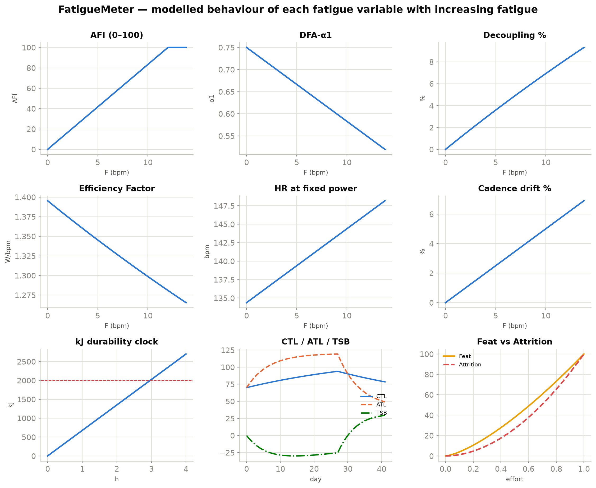
*Vector: [SVG](figures/00_overview.svg)*

### Layer 2 — the acute-fatigue state and index

**`F` — residual cardiovascular-drift state (§4.1–4.2).** The fatigue "engine":
`dF/dt = [κ_i·max(0,P−P_AeT) + κ_d] − F/τ_rec`, so `F` charges toward
`F_ss = charge·τ_rec` during work and relaxes on recovery (κ_d active-gated).
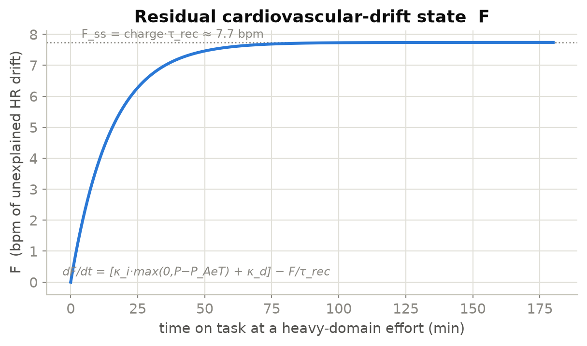
*Vector: [SVG](figures/01_F_drift_state.svg)*

**AFI — Acute Fatigue Index (§4.5).** `AFI = 100·clamp(F/F_ref, 0, 1)` — an
*index*, not a measurement — climbing through the descriptive green/amber/red
bands as `F` rises. AFI is linear in `1/F_ref`, so that one constant sets the
whole scale before calibration.
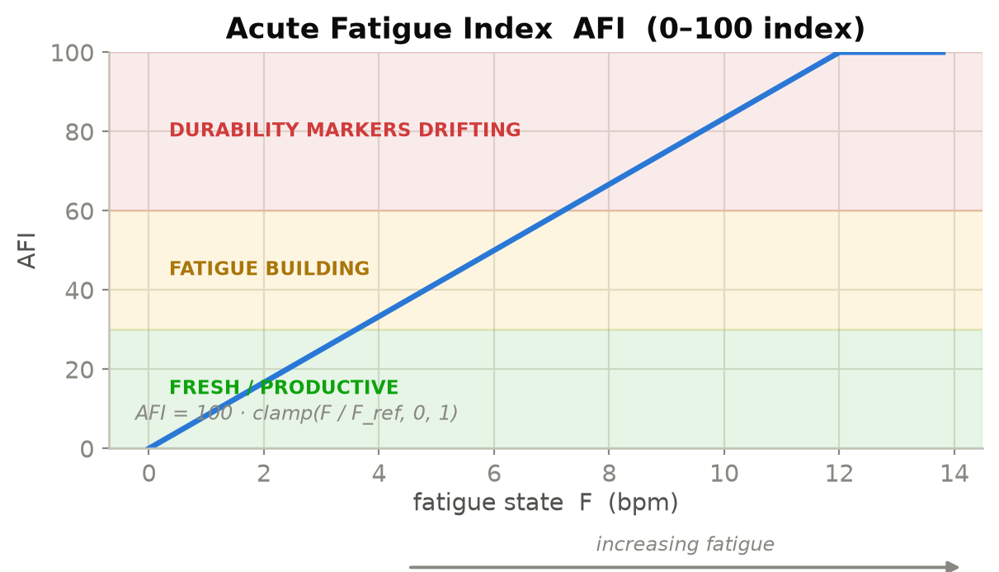
*Vector: [SVG](figures/02_AFI_index.svg)*

### Layer 1 — observable primitives (the validated backbone)

**DFA-α1 (§3.3, §4.2).** (a) the population power→α1 map, a falling sigmoid
crossing the **0.75 aerobic-threshold anchor** at `P_AeT` toward the 0.50
anaerobic anchor; (b) at fixed power, fatigue pulls α1 **below its
baseline-for-power** via the `−c_F·F` coupling — the drift, not the absolute
value, is the fatigue signal.
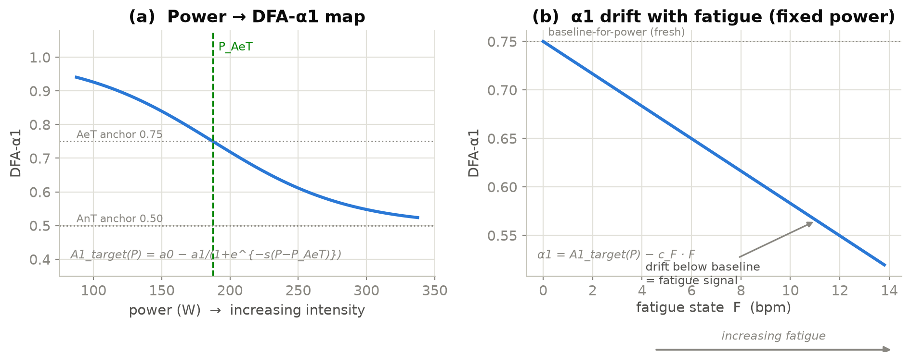
*Vector: [SVG](figures/03_DFA_alpha1.svg)*

**Aerobic decoupling % (§3.1).** As drift lifts HR at fixed power, EF falls and
decoupling `= 100·F/(HR_ss+F)` rises through the Friel 5 / 8 % convention bands.
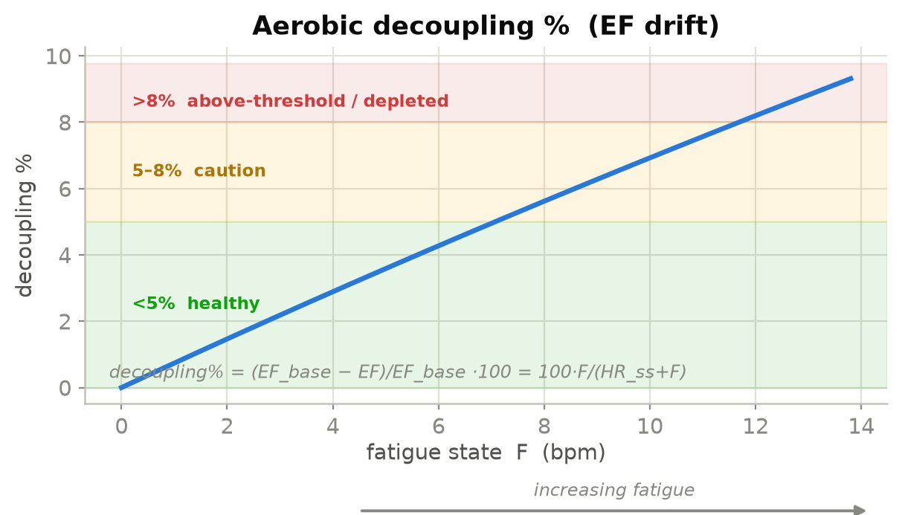
*Vector: [SVG](figures/04_decoupling.svg)*

**Efficiency Factor (§3.1).** `EF = NP/HR` — the mirror of decoupling — declines
from its fresh baseline as fatigue lifts HR.
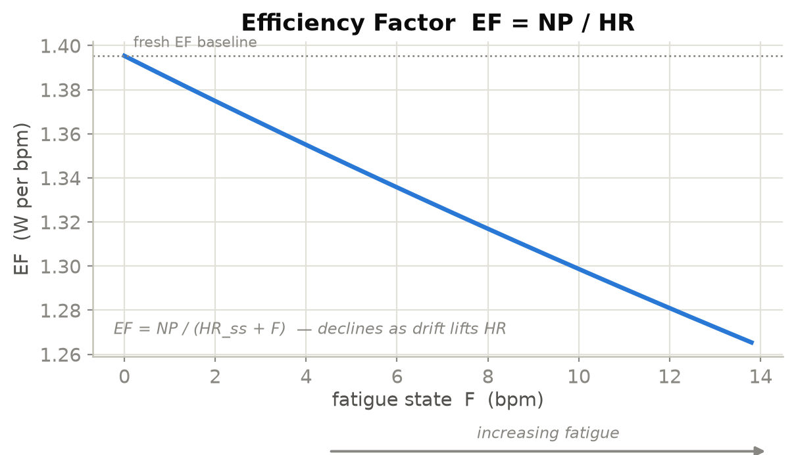
*Vector: [SVG](figures/05_efficiency_factor.svg)*

**Heart rate at fixed power.** The raw cardiovascular drift the model decomposes:
`HR = HR_ss + F` rises linearly with the fatigue state.
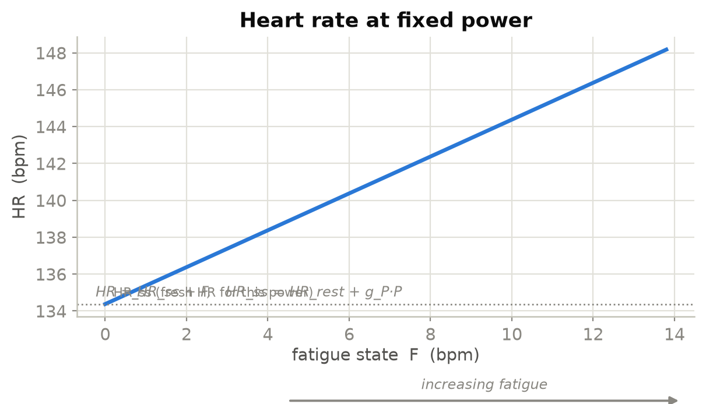
*Vector: [SVG](figures/06_hr_drift.svg)*

**Cadence drift (§3.4).** A **low-weight corroborator** — ~0.6 % decoupling per
rpm of cadence decline (r≈0.40); shown rising modestly with fatigue.
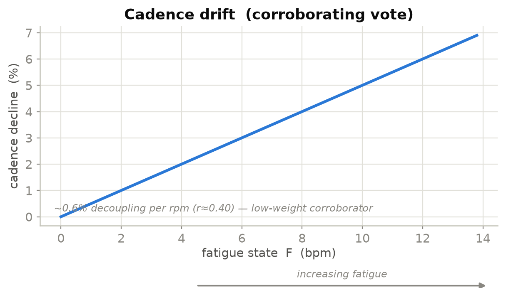
*Vector: [SVG](figures/07_cadence_drift.svg)*

**W′bal and "matches" (§3.4, §8.2).** The Skiba differential reserve depletes in a
sawtooth over hard intervals; each dip below 20 % then recovery is a **match** —
an intuitive count of severe-domain efforts (anaerobic fatigue).
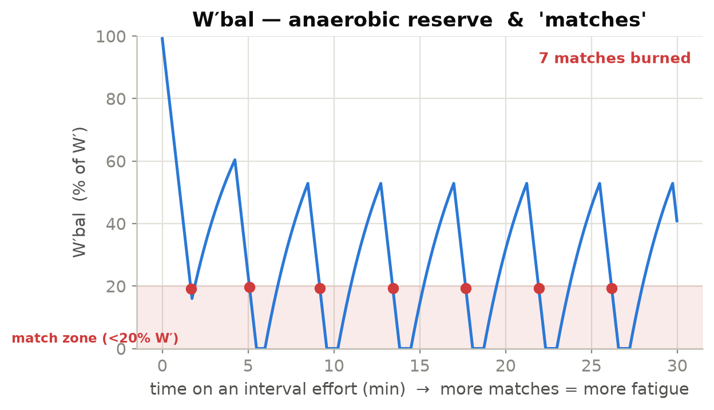
*Vector: [SVG](figures/08_wprime_bal.svg)*

**Intensity-weighted kJ — the durability clock (§3.2).** Accumulates
monotonically toward the person-specific durability anchor (~1500 kJ developing →
~2500 kJ trained); durability decline is driven by *intensity-weighted* work, not
raw volume.
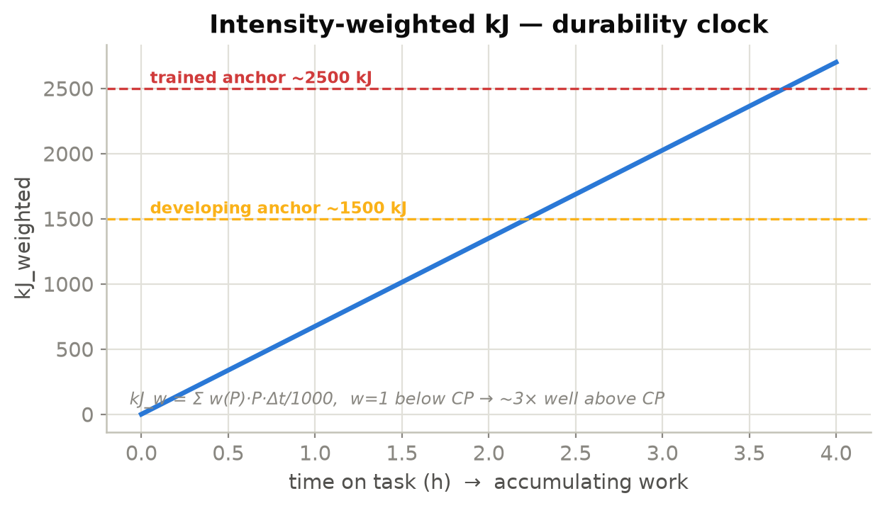
*Vector: [SVG](figures/09_kj_durability_clock.svg)*

### Layer 3 — residual (training-scale) fatigue

**CTL / ATL / TSB (§5).** During a build block ATL (7-day) rises faster than CTL
(42-day), so **TSB = CTL − ATL goes negative** — the residual fatigue carried into
the next ride — then recovers on the taper.
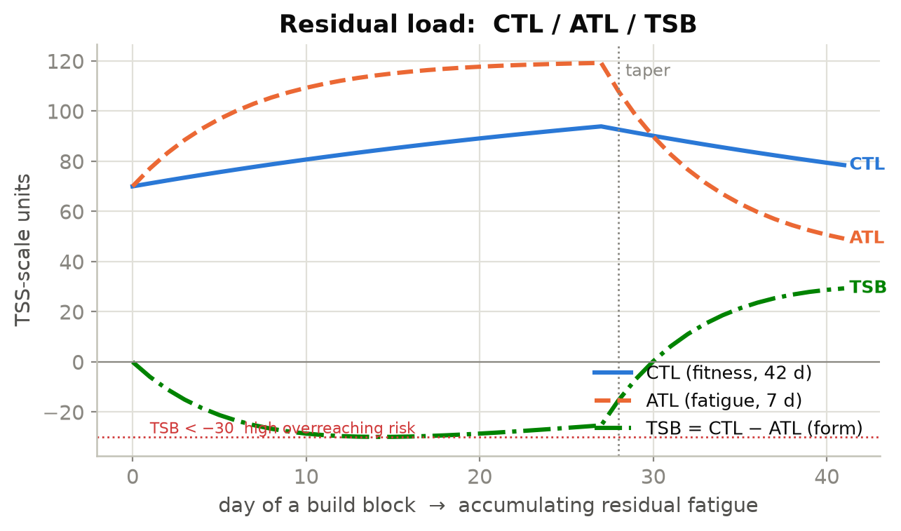
*Vector: [SVG](figures/10_ctl_atl_tsb.svg)*

**Resting RMSSD (§5).** Tracked against the athlete's **personal 7-day rolling
baseline ±1 SD** (not a universal cutoff); a *sustained* decline below −1 SD is
the overreaching flag — single dips are noise.
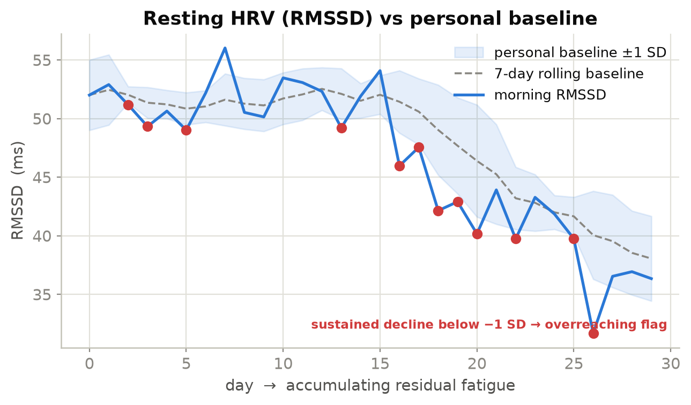
*Vector: [SVG](figures/11_rmssd_baseline.svg)*

### Effort characterization (off the verdict critical path)

**FeatScore vs AttritionScore (§8.2).** Both rise with high-fatigue effort, but
characterize *different* red: **Feat** is fatigue bought with output (kJ>CP,
severe-domain time, W′ matches); **Attrition** is drift at sub-threshold power
past the durability anchor. Context, never a gate.
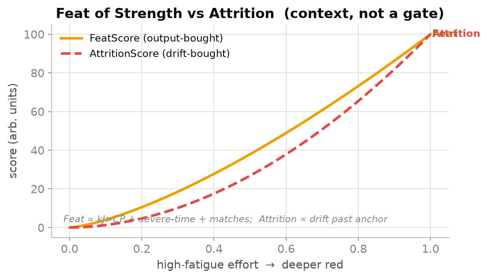
*Vector: [SVG](figures/12_feat_vs_attrition.svg)*
